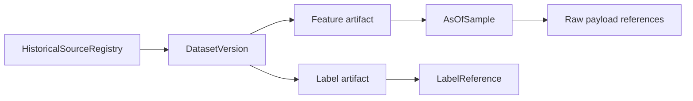

# ADR-0005: Historical As-Of Dataset Foundation

## Status

Accepted for Stage 5A.

## Context

W2 needs historical datasets that can later support modelling without leaking future
information into pre-match features. Stage 5A only establishes the contract,
builders, audits, and guards. It does not import real history, migrate W1, train a
model, or generate recommendations.

## Decision

Historical data is represented as versioned as-of samples:

Labels are physically separate from feature artifacts. Each fixture may have many
as-of samples, and every sample has UTC `as_of_time` and `data_cutoff` values.
Manifests and artifacts use deterministic ordering and SHA256 hashes.

## Consequences

- Real data acquisition remains behind `REAL_HISTORICAL_IMPORT_CHECKPOINT_REQUIRED`.
- Stage 5 remains `PROVISIONAL`.
- Gate 3 is `NOT_STARTED`.
- Gate 2 remains `CLOSED` from Stage 4B live ingestion verification.
