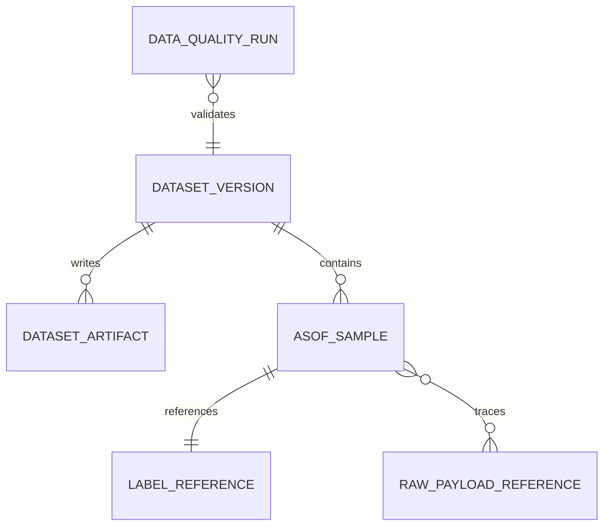

# W2 As-Of Dataset V1

An as-of dataset is a deterministic, versioned collection of pre-match samples.

Required objects:

- `DatasetSource`
- `DatasetVersion`
- `DatasetArtifact`
- `AsOfSample`
- `LabelReference`
- `DataQualityRun`

`AsOfSample` contains fixture identity, competition, season, UTC kickoff,
prediction phase, `as_of_time`, `data_cutoff`, visible odds snapshot, visible
lineup/injury state, visible team ratings/features, raw payload references,
feature snapshot version, label reference, and provenance.

Labels are stored in separate label artifacts and referenced by `LabelReference`.
Feature payloads must not contain result fields such as `home_goals`,
`away_goals`, `result`, `final_score`, or `settlement`.

Stage 5A demo datasets are synthetic only. They are not training data.
