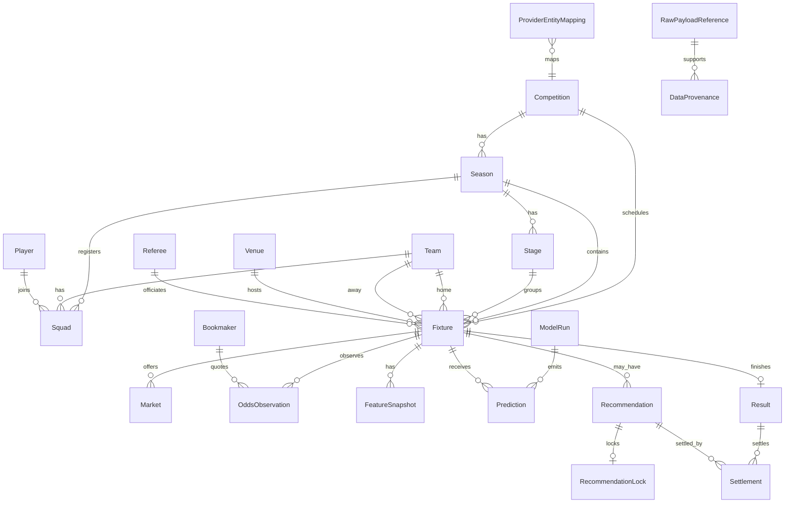

# W2 Domain Model V1

Stage 3 defines the unified football data model only. It does not collect real
data, call Football-API, call DeepSeek, train models, or generate real
recommendations.

Core entities:

- Competition, Season, Stage, Fixture, Team, Player, Squad
- Venue, Referee, Bookmaker, Market, OddsObservation
- Lineup, Injury, Suspension, WeatherObservation, TeamRating
- FeatureSnapshot, ModelRun, Prediction, Recommendation,
  RecommendationLock, Result, Settlement, AuditEvent
- ProviderEntityMapping, RawPayloadReference, DataProvenance

Domain objects are separate from schemas and persistence models. Pydantic
schemas reject unknown fields. SQLAlchemy models define foreign keys, unique
constraints, idempotency keys, and time indexes.

